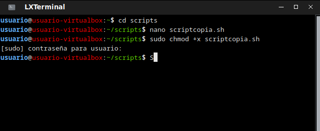

# MERCADAW

## **1. ANÁLISIS**

### **REQUISITOS FUNCIONALES Y NO FUNCIONALES**

### FUNCIONALES

* Dar de alta un producto
* Dar de alta un empleado
* Visualizar los datos del producto
* Visualizar listado de empleados
* Dar de alta una compra
* Listar las compras
* Listar stock de los productos
* Obtener el precio de un producto
* Imprimir una etiqueta para clasificar el producto
* Calcular las nóminas de los trabajadores
* Exportar datos

### NO FUNCIONALES

* Se debe permitir una carga de los datos iniciales, a partir de un fichero, al iniciar la aplicación por primera vez o para recuperar una versión anterior a partir de una copia de seguridad.
* Los datos a cargar estarán en formato CVS, JSON o XML.
* El precio del producto se debe calcular en € y $.
* El listado de compras debe ordenarse por código postal.
* Los datos se deben exportar a excel, pdf u otros formatos.
* Crear copias de seguridad.

## **2. DISEÑO**

## **2.1 DIAGRAMA DE CASOS DE USO**

### **CASOS DE USO GENERAL**


### **CASO DE USO PRODUCTO**


### **CASO DE USO EMPLEADO**


### **CASO DE USO COMPRA**


## **2.2 DIAGRAMAS DE ACTIVIDAD**

### **Dar de Alta**


### **Visualizar Producto**


### **Visualizar Empleados**


### **Alta de Compra**


### **Listar Compras por Código Postal**


### **Listar Stock**


### **Obtener Precio de Venta**


### **Imprimir Etiqueta del Producto**


### **Calcular las Nóminas de los Trabajadores**


### **Exportar Datos**


## **2.3 DIAGRAMAS DE CLASES**

### ENTITY


### MODEL


### UTIL


## **2.4 DIAGRAMA DE COMPONENTES**


## **3. OBSERVACIONES DEL PROYECTO**

### **Clase FileChooser**

He utilizado la clase FileChooser para que salga el selector de archivos para elegir un fichero en la importacion de productos y empleados.

### **Libreria Apache Commons**

He utilizado la libreria Apache Commons para exportar la base de datos a ficheros CSV.

### **Marker Interface**

Hemos usado para la interfaz gestionable el patrón de diseño Marker Interface, que permite clasificar clases sin definir su funcionalidad.

## **4. INSTRUCCIONES**

### Para hacer funcionar la Aplicación correctamente

#### **Scripts**

Para que los scripts funcionen correctamente hay que darle permisos de ejecución, si no, estos no funcionarán y la aplicacion se cerrará al momento de ejecutar la acción que utilice estos mismos. Para darles permiso  de ejcucion, ejecutar el siguiente comando en la carpeta raiz del proyecto:

```bash
sudo chmod +x *.sh
```

#### **Carga de datos**

En la raiz del proyecto encontrarás un archivo .sql donde están las creaciones de las tablas y las vistas, también están todos los inserts.
Para ejecutarlo hay que abrir la extension en VSCode de MariaDB y conectarse a la base de datos con el usuario root después de haber hecho `docker compose up`. Abrir una nueva **Query**, pegar el .sql y ejecutarlo.

## **5. PRUEBAS**

Vamos a proceder a documentar las pruebas que vamos a realizar sobre nuestra aplicación.

En esta ocasión usaremos el método de **caja negra** ya que vamos a hacerlas antes de tener el código.

### **Clases de Equivalencia**

- Vamos a determinar las clases de Equivalencia.

        - Peso Valido >0

        - Altura/Anchura Valida >0

        - Numero Elementos Validos >0

        - Precio Valido >0

### **Conjetura de errores**

- En conjetura de errores al ser productos sabemos que todo no puede ser 0 , ni menor de 0.

        - Conjetura de errores <=0

### **Limites**

- Dentro de los valores validos de los elementos de entrada ,tenemos ciertos limites de los cuales cambiará la actuación del precio respecto a ellos.

1. Peso

    

2. Altura y anchura

    

3. Numero de elementos

    

### **Tabla de apoyo para los casos de prueba**

- Al tener tantos valores he hecho una tabla de apoyo en la que me fijaré para hacer los casos de prueba

    

### **Casos de prueba basados en los valores que teníamos antes**


### **Nomenclatura de pruebas en JUnit 5**

Para hacer las pruebas en JUnit 5 en concordancia con la ta tabla , hemos hecho un guía burros muy básico.

En este caso por prueba tenemos Caso! que en Junit 5 sería calcularPrecioCaso**Uno**Test.

Y asi con cada caso sumándole uno.

```java
    @Test
    public void calcularPrecioCasoUnoTest() {
        Producto p = new Alimento("a", "a", "a", 1, 0, 0, 0.5, 1);

        assertEquals(1.44, p.calcularPrecio(), 0.09);
    }
```

## **6. COPIA DE SEGURIDAD SCRIPT**

Abrimos terminal y creamos una carpeta donde se vayan a depositar los backup de la base de datos (Destino)

Creamos otra carpeta donde vamos a tener nuestro script que generara copias de seguridad y las exportara en formato zip con el nombre de bacap y la fecha del mismo


Damos permoso de ejecución con el comando chmod +x





Por ultimo ejecutamos el comando crontab -e y ponemos cada cuanto tiempo(minutos,hora,dia,mes y dia de la semana) queremos que se ejecute nuestro script


