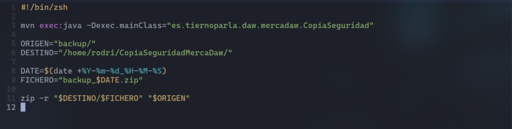
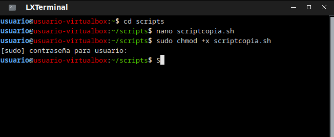

# Documentación

## Copia de seguridad script

Abrimos terminal y creamos una carpeta donde se vayan a depositar los backup de la base de datos (Destino)

Creamos otra carpeta donde vamos a tener nuestro script que generara copias de seguridad y las exportara en formato zip con el nombre de bacap y la fecha del mismo

Damos permoso de ejecución con el comando chmod +x

Por ultimo ejecutamos el comando crontab -e y ponemos cada cuanto tiempo(minutos,hora,dia,mes y dia de la semana) queremos que se ejecute nuestro script

