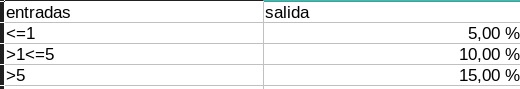
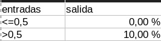
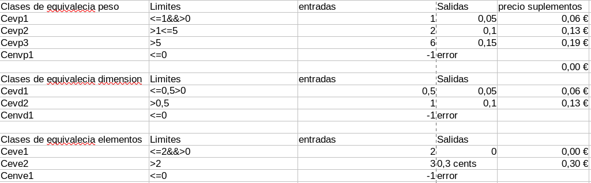
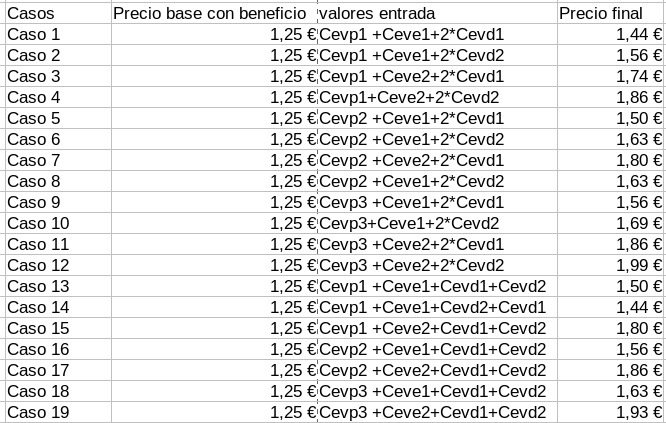

# Documentación Pruebas

Vamos a proceder a documentar las pruebas que vamos a realizar sobre nuestra aplicación.

En esta ocasión usaremos el método de **caja negra** ya que vamos a hacerlas antes de tener el código.

## Clases de Equivalencia

- Vamos a determinar las clases de Equivalencia.

        - Peso Valido >0

        - Altura/Anchura Valida >0

        - Numero Elementos Validos >0

        - Precio Valido >0

## Conjetura de errores

- En conjetura de errores al ser productos sabemos que todo no puede ser 0 , ni menor de 0.

        - Conjetura de errores <=0

## Limites

- Dentro de los valores validos de los elementos de entrada ,tenemos ciertos limites de los cuales cambiará la actuación del precio respecto a ellos.

1. Peso

    

2. Altura y anchura

    

3. Numero de elementos

    

## Tabla de apoyo para los casos de prueba

- Al tener tantos valores he hecho una tabla de apoyo en la que me fijaré para hacer los casos de prueba

    

## Casos de prueba basados en los valores que teníamos antes



## Nomenclatura de pruebas en JUnit 5

Para hacer las pruebas en JUnit 5 en concordancia con la ta tabla , hemos hecho un guía burros muy básico.

En este caso por prueba tenemos Caso! que en Junit 5 sería calcularPrecioCaso**Uno**Test.

Y asi con cada caso sumándole uno.

```java
    @Test
    public void calcularPrecioCasoUnoTest() {
        Producto p = new Alimento("a", "a", "a", 1, 0, 0, 0.5, 1);

        assertEquals(1.44, p.calcularPrecio(), 0.09);
    }
```
